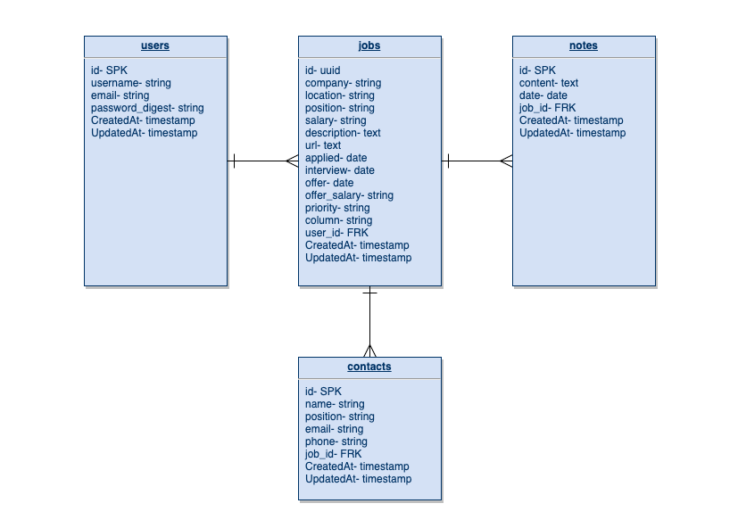

# APP/LY

- [Overview](#overview)
- [MVP](#mvp)
  - [Goals](#goals)
  - [Libraries and Dependencies](#libraries-and-dependencies)
  - [Client (Front End)](#client-front-end)
    - [Wireframes](#wireframes)
    - [Component Tree](#component-tree)
    - [Component Architecture](#component-architecture)
    - [Time Estimates](#time-estimates)
  - [Server (Back End)](#server-back-end)
    - [ERD Model](#erd-model)
- [Post-MVP](#post-mvp)
- [Code Showcase](#code-showcase)
- [Code Issues & Resolutions](#code-issues--resolutions)

<br>

## Overview

_**App/ly** is a job application tracking app that will help organize information and contacts for users during their job search. Users can start by creating an account, and then start adding information about any job openings that they're interested in. Once added to the user's database, they can go back to view the details, update important dates and information as they progress in the application process, and even leave notes and add contacts for each job posting._

<br>

## MVP

_The **App/ly** MVP is a full CRUD, full stack application with a Rails back end and React front end. It is fully responsive, styled with CSS and Styled Components._

<br>

### Goals

- _RESTful JSON API built with Ruby on Rails with full CRUD_
- _Full CRUD interactive front end built with React_
- _Forms to input job postings, notes on job postings, and contacts_
- _Display all job postings saved to user's account along with notes and contacts_
- _Implement Auth for users_
- _Fully responsive styling with two media queries_
- _Clean, organized, structured code_

<br>

### Libraries and Dependencies

|       Library       | Description                                                   |
| :-----------------: | :------------------------------------------------------------ |
|        React        | _Lorem ipsum dolor sit amet, consectetur._                    |
|    React Router     | _Lorem ipsum dolor sit amet, consectetur._                    |
| React-beautiful-dnd | _Beautiful and accessible drag and drop for lists with React_ |
|        axios        | _Lorem ipsum dolor sit amet, consectetur._                    |
|       bcrypt        | _Lorem ipsum dolor sit amet, consectetur._                    |
|         jwt         | _Lorem ipsum dolor sit amet, consectetur._                    |
|        cors         | _Lorem ipsum dolor sit amet, consectetur._                    |

<br>

### Client (Front End)

#### Wireframes

> Use the Wireframes section to display desktop, tablet and mobile views. No hand-drawn wireframes. Use a tool like wireframe.cc, Whimsical or AdobeXD


- Desktop Landing


- Desktop Hero


- Resource Index


- Resource Show


- Tablet Resource Index


- Mobile Resource Index

#### Component Tree

> Use this section to display the structure of how your React components are being rendered. This should show the parent to child relation between you components. In other words, show which components are rendering the other components. Include a link to your component tree

[Component Tree Sample](https://gist.git.generalassemb.ly/davidtwhitlatch/414107e2560ae0bb65e233570f2fe056#file-component-tree-png)

#### Component Architecture

> Use this section to define your React components and the data architecture of your app. This should be a reflection of how you expect your directory/file tree to look like.

```structure

src
|__ assets/
      |__ icons
      |__ images
      |__ mockups
|__ components/
      |__ ContactCreate.jsx
      |__ ContactEdit.jsx
      |__ Header.jsx
      |__ JobCreate.jsx
      |__ JobEdit.jsx
      |__ Navbar.jsx
|__ containers/
      |__ MainContainer.jsx
|__ layouts/
      |__ Layout.jsx
|__ screens/
      |__ Contacts.jsx
      |__ JobDetail.jsx
      |__ SignIn.jsx
      |__ SignUp.jsx
|__ services/
      |__ api_config.js
      |__ auth.js
      |__ jobs.js

```

#### Time Estimates

> Use this section to estimate the time necessary to build out each of the components you've described above.

| Task                | Priority | Estimated Time | Time Invested | Actual Time |
| ------------------- | :------: | :------------: | :-----------: | :---------: |
| Add Contact Form    |    L     |     3 hrs      |     2 hrs     |    3 hrs    |
| Create CRUD Actions |    H     |     3 hrs      |     1 hrs     |     TBD     |
| TOTAL               |          |     6 hrs      |     3 hrs     |     TBD     |

> _Why is this necessary? Time frames are key to the development cycle. You have limited time to code your app, and your estimates can then be used to evaluate possibilities of your MVP and post-MVP based on time needed. It's best you assume an additional hour for each component, as well as a few hours added to the total time, to play it safe._

<br>

### Server (Back End)

#### ERD Model


<br>

---

## Post-MVP

- _Kanban board to keep track of where in the process your different applications are_
- _Companies table to separate that information out and allow sorting by companies with multiple job postings_
- _Use active storage for uploading and keeping track of different resumes and cover letters_

---

## Code Showcase

> Use this section to include a brief code snippet of functionality that you are proud of and a brief description.

## Code Issues & Resolutions

> Use this section to list of all major issues encountered and their resolution.
