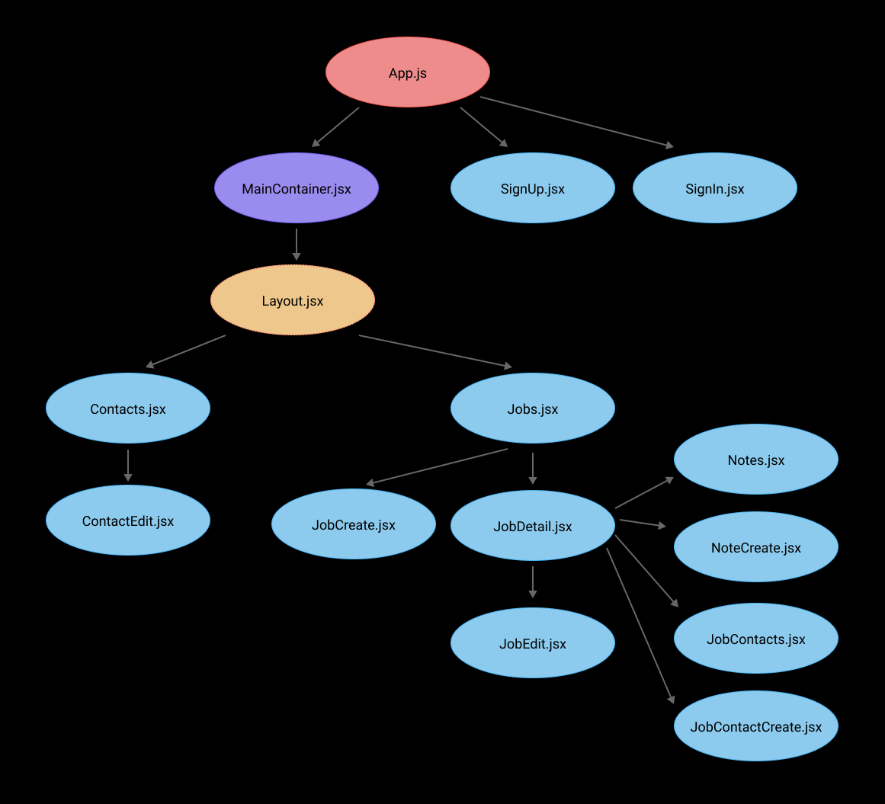

# APP/LY

- [Overview](#overview)
- [MVP](#mvp)
  - [Goals](#goals)
  - [Libraries and Dependencies](#libraries-and-dependencies)
  - [Client (Front End)](#client-front-end)
    - [Wireframes](#wireframes)
    - [Component Tree](#component-tree)
    - [Component Architecture](#component-architecture)
    - [Time Estimates](#time-estimates)
  - [Server (Back End)](#server-back-end)
    - [ERD Model](#erd-model)
- [Post-MVP](#post-mvp)
- [Code Showcase](#code-showcase)
- [Code Issues & Resolutions](#code-issues--resolutions)

<br>

## Overview

_**App/ly** is a job application tracking app that organizes job posts and contacts for users during their job search. Users can start by creating an account, and then start adding information about any job openings that they're interested in. Once added to the user's database, they can go back to view the details, update important dates and information as they progress in the application process, and even leave notes and add contacts for each job posting. They can also move items around on the job tracking board according to where they are in the application process._

<br>

## MVP

_The **App/ly** MVP is a full CRUD, full stack application with a Rails back end and React front end. It is fully responsive, styled with CSS and Styled Components._

<br>

### Goals

- _RESTful JSON API built with Ruby on Rails with full CRUD_
- _Full CRUD interactive front end built with React_
- _Forms to input job postings, notes on job postings, and contacts_
- _Display all job postings saved to user's account along with notes and contacts_
- _Implement Auth for users_
- _Fully responsive styling with two media queries_
- _Clean, organized, structured code_

<br>

### Libraries and Dependencies

|       Library       | Description                                                                                    |
| :-----------------: | :--------------------------------------------------------------------------------------------- |
|        React        | _Javascript library for building user interfaces_                                              |
|    React Router     | _Library for routing, enabling navigation between components_                                  |
| React-beautiful-dnd | _Beautiful and accessible drag and drop for lists with React_                                  |
|        axios        | _Promise-based HTTP client for Node.js and the browser_                                        |
|       bcrypt        | _Password hashing function_                                                                    |
|         jwt         | _Securely transmits information between parties as a JSON object_                              |
|        cors         | _Allows a server to indicate any origins from which a browser should permit loading resources_ |
|        uuid         | _Creates unique identifiers_                                                                   |
|  Styled-Components  | _Create components for styling_                                                                |

<br>

### Client (Front End)

#### Wireframes

[Link to Wireframes](https://www.figma.com/file/BXyZWYWtr7aOrBZy27KO4o/p4?node-id=0%3A1)

- Desktop Landing / Sign In and Sign Up screens


- Jobs screens / See all jobs, details, and create/edit forms


- Contacts screens / All contacts and forms


- Job Application Tracking Board


- Sign up and jobs on mobile


#### Component Tree



#### Component Architecture

> Use this section to define your React components and the data architecture of your app. This should be a reflection of how you expect your directory/file tree to look like.

```structure

src
|__ assets/
      |__ icons
      |__ images
      |__ mockups
|__ components/
      |__ ContactCard.jsx
      |__ ContactCreate.jsx
      |__ ContactEdit.jsx
      |__ DeleteAlert.jsx
      |__ Header.jsx
      |__ JobCard.jsx
      |__ JobCreate.jsx
      |__ JobEdit.jsx
      |__ JobForm.jsx
      |__ Navbar.jsx
      |__ NoteCard.jsx
|__ containers/
      |__ MainContainer.jsx
|__ layouts/
      |__ Layout.jsx
|__ screens/
      |__ Board.jsx
      |__ Contacts.jsx
      |__ Jobs.jsx
      |__ JobDetail.jsx
      |__ SignIn.jsx
      |__ SignUp.jsx
|__ services/
      |__ api_config.js
      |__ auth.js
      |__ contacts.js
      |__ jobs.js

```

#### Time Estimates

| Task                              | Priority | Estimated Time | Time Invested | Actual Time |
| --------------------------------- | :------: | :------------: | :-----------: | :---------: |
| Wireframes, ERD, Component Tree   |    H     |     3 hrs      |     3 hrs     |    3 hrs    |
| Set up and test CRUD on back end  |    H     |     2 hrs      |     2 hrs     |    2 hrs    |
| Set up React App                  |    H     |      1 hr      |     1 hr      |    1 hr     |
| Create file structure             |    H     |      1 hr      |     1 hr      |    1 hr     |
| Create and test CRUD on front end |    H     |     3 hrs      |     3 hrs     |    3 hrs    |
| Create layout components          |    H     |     3 hrs      |     2 hrs     |    2 hrs    |
| Create sign in/sign up screens    |    H     |     3 hrs      |     4 hrs     |    4 hrs    |
| Create jobs screen                |    H     |     5 hrs      |     5 hrs     |    5 hrs    |
| Create job detail screen          |    H     |     3 hrs      |     5 hrs     |    5 hrs    |
| Create form components            |    H     |     3 hrs      |     3 hrs     |    3 hrs    |
| Create contacts screen            |    H     |     3 hrs      |     3 hrs     |    3 hrs    |
| Basic styling                     |    H     |     5 hrs      |     5 hrs     |    5 hrs    |
| Test and clean up code            |    H     |     3 hrs      |     6 hrs     |    6 hrs    |
| Advanced Styling and finetuning   |    M     |     6 hrs      |     6 hrs     |    6 hrs    |
| Post MVP                          |    L     |     6 hrs      |     8 hrs     |     TBD     |
| TOTAL                             |          |     51 hrs     |    57 hrs     |     TBD     |

<br>

### Server (Back End)

#### ERD Model


<br>

---

## Post-MVP

- _Kanban board to keep track of where in the process your different applications are_
- _Companies table to separate that information out and allow sorting by companies with multiple job postings_
- _Use active storage for uploading and keeping track of different resumes and cover letters_

---

## Code Showcase

_The tracking board was a lot of fun to implement and it took some conditional rendering and toggles to achieve what I wanted it to do. The first piece of code is part of the styled component for the draggable items to render the correct color according to the priority level._

```
const DraggableItem = styled.div`
  background-color: #FFFFFF;
  background-image: ${props =>
    props.priority === '3' ? 'linear-gradient(90deg, #E94D4D 2%, #FFFFFF 0)' :
    props.priority === '2' ? 'linear-gradient(90deg, #F4C78E 2%, #FFFFFF 0)' :
    'linear-gradient(90deg, #0F3875 2%, #FFFFFF 0)'};
  border: ${props =>
    props.priority === '3' ? '1px solid #E94D4D' :
    props.priority === '2' ? '1px solid #F4C78E' :
    '1px solid #0F3875'};
```

_And here is where I have the item render different things according to which column it's in and whether the item was clicked for more details (toggling the showMore)._

```
  <DetailsDiv>
    <DetailsTitle>{item.company}</DetailsTitle>
    <DetailsText>{column.name==='applied' ? item.applied :
      column.name==='interview' ? item.interview :
      column.name==='offer' ? item.offer :
      ''}
    </DetailsText>
  </DetailsDiv>
  <DetailsDiv>
    <DetailsText>{item.position}</DetailsText>
  </DetailsDiv>
    {showMore && detailsId === item.id ? (
      <ShowMore>
        <DetailsText>Location: {item.location}</DetailsText>
        <DetailsText>Salary: {item.salary}</DetailsText>
        <DetailsText>
          {column.name==='interviews' ? (
            <>
              Applied: {item.applied} </>) :
           column.name==='offers' ? (
             <>
                Applied: {item.applied}<br/>
                Interviewed: {item.interview}
              </>) :
            ''}
        </DetailsText>
      </ShowMore>
    ) : ''}
```

## Code Issues & Resolutions

- _I ran into the issue of the board columns not updating for each job when moved to a different column and it took some troubleshooting to figure out that the backend wasn't updated properly when I added the 'board' attribute to the jobs._
- _Realized a bit too late that the items are not keeping their order within each column because the jobs array is updating every time the state changes. Will do a rework of this and perhaps create a board table to handle all the board changes more elegantly._
